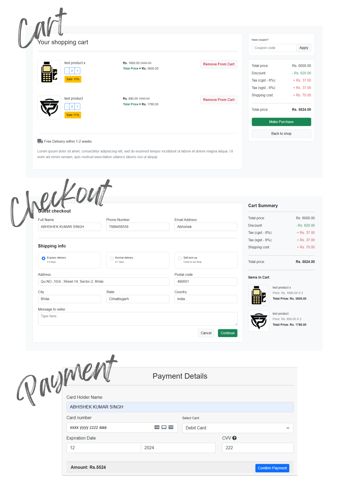
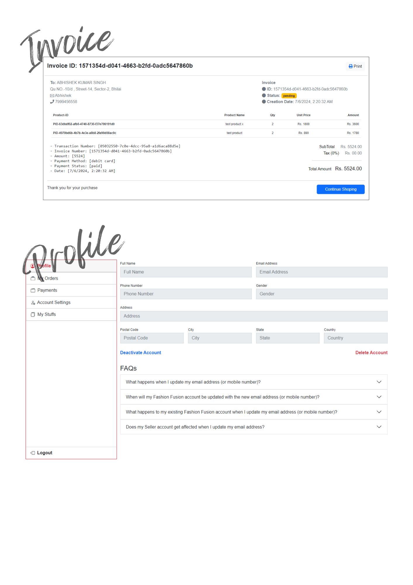

# Fashion Fusion - Myntra Clone

## [Visit Website Here..](https://fashion-fusion.dreel.co/)

## Project Overview

Fashion Fusion is a collaborative project aimed at developing a Myntra clone, incorporating various features to elevate the online shopping experience. Leveraging React.js for frontend development and Firebase for data storage, the project focuses on seamless navigation and intuitive user interfaces.

## Features

- **Authentication System:** Implemented secure user authentication and authorization mechanisms.
- **Admin Dashboard:** Streamlined product and order management capabilities for administrators.
- **Product Management:** Customizable product attributes including size, color, price, and discounts.
- **Browsing & Shopping:** Enhanced browsing experience with seamless purchasing options.
- **Filtering:** Refinement of product searches based on specific criteria.
- **Cart & Checkout:** Seamless purchase experience with cart management and secure checkout.
- **Order Management & Tracking:** Efficient order placement, processing, and real-time tracking for users.

## Previews

## Technologies Used

- Frontend: React.js, Bootstrap, Custom CSS
- Backend: Firebase (Authentication, Firestore)
- Payment Gateway: Stripe API

## Installation

1. Clone the repository:

    - git clone `https://github.com/ABHISHEK-SIN-GH/Fashion-Fusion.git`.

2. Install dependencies:

    - npm install

3. Set up Firebase:

    - Create a Firebase project and set up Authentication and Firestore.
    - Update Firebase configuration in `src/firebase/firebase.js`.

4. Set up Stripe:

    - Create a Stripe account and obtain API keys.
    - Update Stripe API keys in the backend code for payment processing.

## Usage

To start the development server:

    npm run start

## Acknowledgements

We would like to thank the creators of Myntra for their inspiration and guidance in developing this project.

---

For more information, please visit the project's GitHub repository [here](https://github.com/ABHISHEK-SIN-GH).
